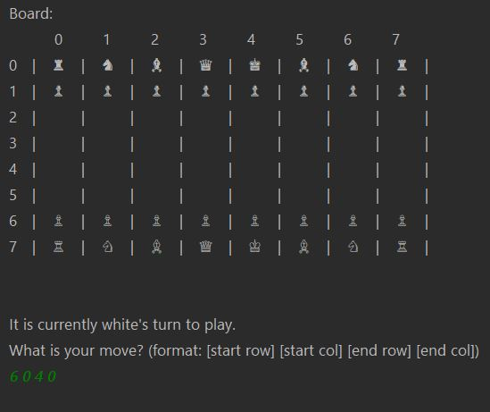

# chessboardgame

This project is developing a simplified version of the popular board game chess. will utilize 2D Arrays to represent a chess board, 
and will write functions that enforce the rules of the game.

It is terminal based project (with normal GUI).

